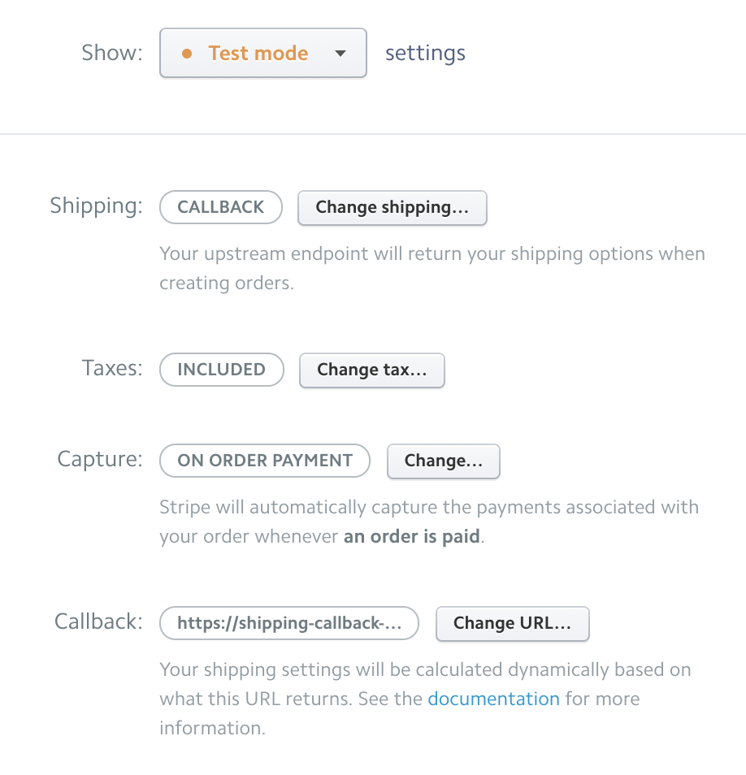

# Shipping Callback Mockup

Originally we had set Stripe to ask Shippo for shipping options. Because of the way that their API works, we needed to pay for one of the shipping methods when paying for the order, there is no option for 'none of the above'. There also seems to be no way to configure Shippo to include a free pickup option in its responses to Stripe.

The solution is to have Stripe ask us for shipping options using a callback. We then ask Shippo for shipping options, and append our free pickup option to that before sending it back to Stripe.

In a settings page on Stripe, I changed my accounts shipping option to `callback`, and the callback URL to the heroku address of the callback route that I made (`https://shipping-callback-mockup.herokuapp.com/shipping`):

The mockup is [here](https://shipping-callback-mockup.herokuapp.com/)

You can read more about shipping dimensions [here](https://goshippo.com/docs/stripe#stripe-shipping-concepts)
